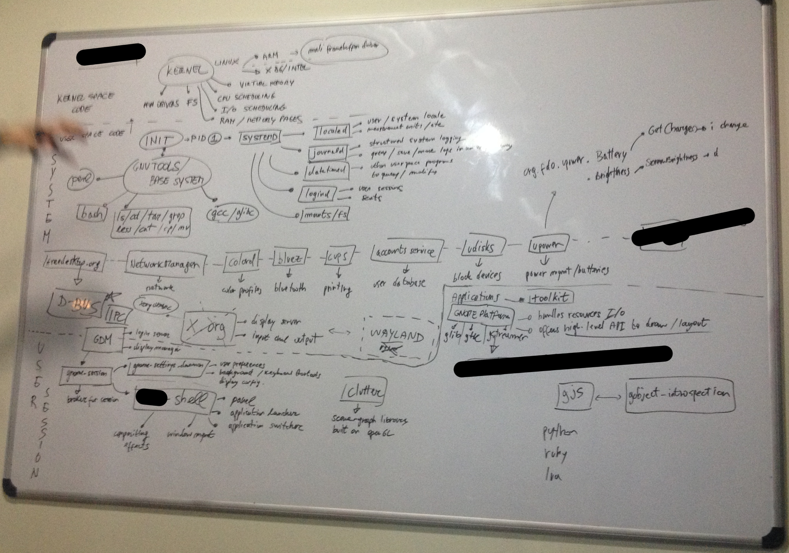
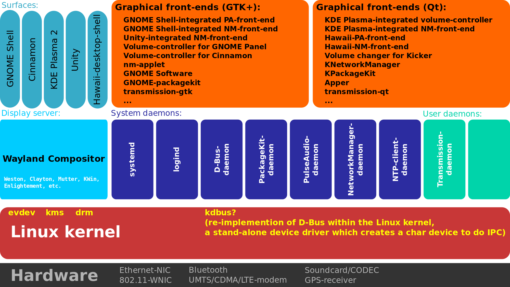

## Linux and the command line

### Linux

* Linux is a kernel - a very low-level layer of abstraction over the hardware. It provides an API to programs
* Windows has a kernel, and OSX has a kernel (called Darwin)
* Most programs don't use these kernel APIs - they use a layer on top of it. In Windows, a popular API is .NET. In OSX, a popular layer is Cocoa. In Linux, a popular layer is GLib (which is used in the GNOME desktop).
* This is why Richard Stallman wants people to refer to Linux as GNU/Linux - because most Linux distributions are built on both the Linux kernel and GNU tools, which is a set of applications that make the Linux kernel useful. These applications include the GCC compiler and the GNU build system.
* Most Linux distributions are really complicated and made up of a lot of moving parts. This is a diagram of what software Debian Linux with the GNOME desktop will look like in a year or so:

(Image released under [CC-BY-SA 3.0](https://creativecommons.org/licenses/by-sa/3.0/))

(Image released under [CC-BY-SA 3.0](https://creativecommons.org/licenses/by-sa/3.0/) ([link](https://en.wikipedia.org/wiki/PackageKit#/media/File:Linux_desktop_system_daemons_and_their_graphical_front-ends.svg)))

##### Differences between Linux and Windows/OSX

* [Linux for the Windows user](http://linux.wikia.com/wiki/Linux_explained_to_the_Windows_user)
* Using Linux is similar to using OSX with Homebrew and the command line

##### Desktops

* A desktop is a complete collection of useful software, a GUI, and everything that the user sees, such as an application launcher
* Different desktops have different APIs for building software and different ways of representing GUIs
* There are two major desktops (and many less popular ones): KDE and GNOME
* Most Linux distributions can run software intended for either type - if a user is running GNOME, they just have to install the KDE libraries to run KDE software
* Because these desktops are abstracted, they don't even require the Linux kernel - they can be run on other types of kernels (such as BSD Unix)

##### Distribtions

* Distributions are just a collection of specific software and a Linux kernel
* Examples: Ubuntu, Debian, Fedora
* Many distributions give users the choice of which type of desktop they use
* Most distributions are intended to be run out of the box - by downloading a disk image and installing it just as you would install Windows

* The software that is included is determined by the leaders of the distribution, who can also customize much of it
* This means that if you need to install a piece of software you usually download it from a repository owned by the distribution owners
* Unlike the classic way of installing OSX or Windows applications, most distributions let you install a piece of software with a simple command
    * On Debian/Ubuntu: `sudo apt-get install python` to install python
    * sudo - run with super-user privileges
    * apt-get install - use the Aptitude package manager to install something
    * python - name of the package to be installed

###### Dependencies

* A software package can have other packages that it needs in order to run (dependencies)
* For example, a Java application could require Java 7 or 8 to be installed
* These dependencies (and the required versions) are usually handled automatically by the package manager
* Most Linux programs use dynamic linking, while many Windows programs use static linking. Dynamic linking means that libraries that are commonly used (such as JavaFX) are downloaded separately from the programs and shared between programs. This means that programs do not have to be updated if libraries are updated (usually to fix security vulnerabilities)
* [Static and Dynamic linking explained](http://cs-fundamentals.com/tech-interview/c/difference-between-static-and-dynamic-linking.php)

###### Source vs Binary

* When you run C source code through a compiler, it outputs a runnable assembly program. This program is the binary
* The software installed from package managers are usually binaries, because compiling source code can take a lot of time
* In order to actually change the program, you need the source code
* This binary can be of a different form if other languages are used - for example, Java binaries require a Java Virtual Machine

##### Further reading (not required)

* How Linux Works, Second Edition - chapters 1 (The big picture), 14 (A brief survey of the Linux desktop)
